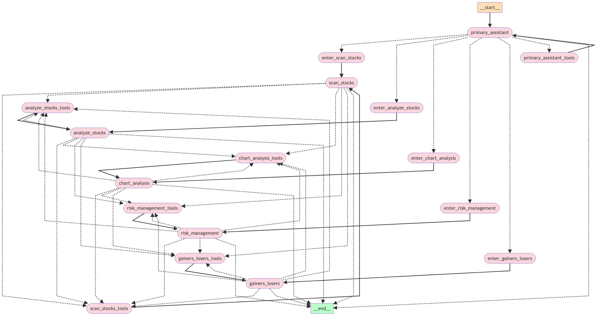

# Financy_ChatBot

## Features

- Fetches financial data using OpenBB
- Generates technical analysis summaries using AI
- Provides stock price history, quantitative stats, and more
- Calculates relative strength for stocks
- Sentiment analysis on news articles
- Universe scanning using FinViz filters
- Risk management techniques using technically-derived stops and R Multiples
- Interactive Streamlit UI for chat-based interaction
- Multiple Agent Workflows using LangGraph
- Deployment to AWS with the Copilot CLI

## Installation

1. Install the required dependencies using Poetry:

```bash
poetry install
```

2. Set up the necessary environment variables. You can create an `.env` at the project root for these:

```bash
export OPENAI_API_KEY=<your-api-key>
export OPENBB_TOKEN=<your-openbb-token>
export TIINGO_API_KEY=<your-tiingo-api-key>
export IMGUR_CLIENT_ID=<your-imgur-client-id>
export IMGUR_CLIENT_SECRET=<your-imgur-client-secret>
export FMP_API_KEY=<fmp-api-key>
export INTRINIO_API_KEY=<intrinio-api-key>
```

## Usage

### Streamlit UI

Run the Streamlit app:

```bash
streamlit run app/ui.py
```

### FastAPI Server

Start the FastAPI server:

```bash
uvicorn app.server:app --host 0.0.0.0 --port 8080
```

You can view the [Swagger Docs](http://0.0.0.0:8080/docs) and test out the [Playground](http://0.0.0.0:8080/chat/playground), courtesy of [LangServe](https://python.langchain.com/v0.2/docs/langserve).

## Docker

Build the Docker image:

```bash
docker build -t Financy_ChatBot .
```

Run the Docker container:

```bash
docker run -p 8080:8080 --env-file .env Financy_ChatBot
```

## Project Structure

- `app/`: Main application code
  - `chains/`: LangChain agent and prompts
  - `features/`: Feature-specific code (technical analysis, charting)
  - `tools/`: Custom tools for data retrieval and analysis
  - `ui.py`: Streamlit UI
  - `server.py`: FastAPI server
- `Dockerfile`: Dockerfile for building the application
- `pyproject.toml`: Project dependencies and configuration
- `README.md`: Project documentation

## Flowchart


